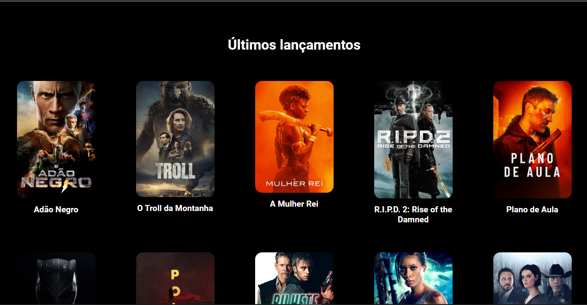

# Lista de filmes

#### Ultimos lançamentos!

> Pequena demonstração em gif da aplicação!
> 

 

Nessa aplicaçao voce pode conferir os filmes q estão em lançamento, podendo ver a sinopse, a data de lançamento e a imagem do cartaz. Aplicação foi feita em react, utilizando hooks, styled-components e react-router-dom v6. As informaçoes dos filmes foram feitas pela API do The Movie Database (TMDB). Para ter acesso a API voce tera que fazer login no site do TMDB para pegar a "key" da api.

  

Link da aplicação:
